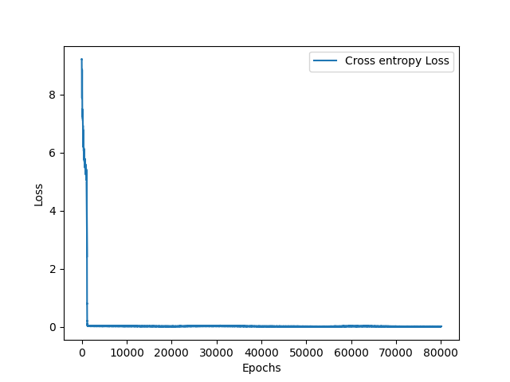

# GPT-Style Model

This repository contains both simple and Longformer versions of a GPT architecture. The key goal is to explore the differences in efficiency and performance between a standard GPT model and a GPT with Longformer-style sliding window and global attention. The model is trained on text data tokenized and split into sequences of various lengths (256, 512, 1024). Results for these experiments are stored in the results folder.

Use files in the following order:

- `download_data.py` to grab a dataset from huggingface and store in a single text file.
- `hftokenizer.py` to train a tokenizer on this data.
- `construct_dataset.py` to tokenize the data and pack into sequences of a given length, separated by EOS token.
- `train.py` to train a model and produce a loss curve
- `generate.py` to generate text with your trained model
- `main.ipynb` is the Google Colab training notebook. This is setup to perform experiments on both model architectures. Pre-requisites include adding the gpt model files and datasets to google drive, then uploading. Additionally, the notebook includes a work in progress implementation of using the Allen AI Institute's pre-trained Longformer model for validation of results.

## Results

Results of the experiments are stored in the `results` folder, which is divided into three directories:
- **256/**: Contains results for models trained on 256-token sequences.
- **512/**: Contains results for models trained on 512-token sequences.
- **1024/**: Contains results for models trained on 1024-token sequences.

- **Metrics CSV files**: These files contain loss and perplexity logs for each epoch and batch.
- **Loss plots**: PNG images of the loss curve over the training epochs.
- **Model weights**: Saved model weights in `.pt` format, allowing you to reload the model for further training or inference.

Example Loss Curve:

Example Generations (**input in bold**):

**Steve Jobs was** filmed on both films from the late 1960s until production started at Simply Straight Studios in Springfield, California. Filming for Glastonbury Apocalypse and gig received minor filming locations across Europe as all western German ports had more free @-@ to @-@ back than Berlin'archives today ; only another ship set off Toronto boundaries of an artificial war surrounded by vehicle blocks which could be transported with lots or scrap metal banners made up within Shore

**In 1776, the American colonists** moved into Taunton and isolated in pursuit, a small number of advances brought from the colony. This enforced an economic expansion to it with mitigated immigrants who feared that freed slaves could pay their reward for themselves without slavery ( Mizemalez dissimilarly nevertheless pointed out later than did ) — this first time Martha Edward wrote nothing more about Henry's execution following his assassination – as she referred James de Gaulle to Lieutenant

**The Godfather is a film about** the negative effect of evil and soul. However, it was adapted into an abortive biography written by Herman Whitman in 1983 during Tree Films for which Tarantino compares her impression to Ikherjohn's book The Titans : An Adventure Time Christmas as its main villain who transcendes history with many defects such as children under birthboards that entertain people never enjoy their lives outside society or else will later serve usatically until human